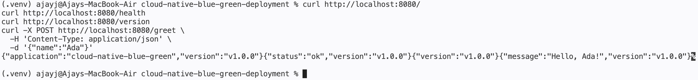
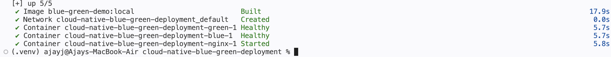
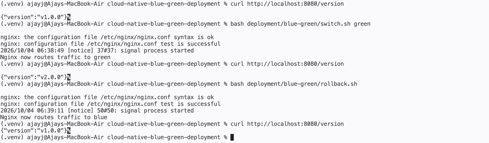
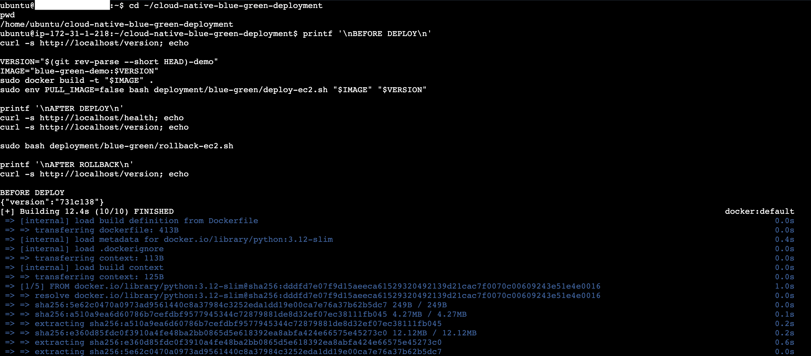
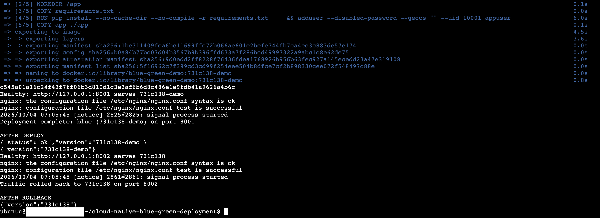
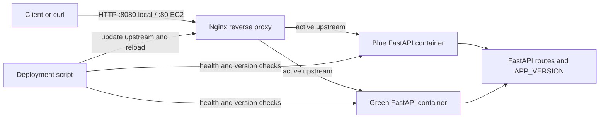
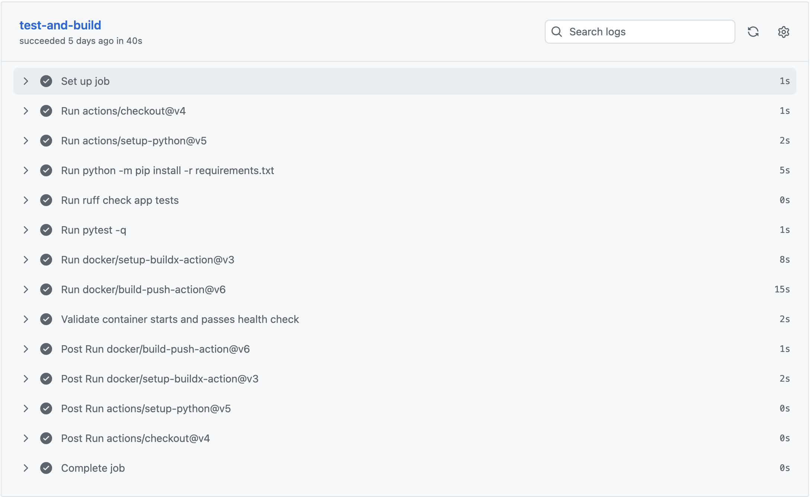

# 1. Cloud-Native Blue-Green Deployment Pipeline

A learning project demonstrating a FastAPI application deployed in Blue and Green slots behind Nginx. Deployment scripts start and validate a release in the inactive slot before directing traffic to it. The project includes a local Docker Compose demonstration and a manually operated, single-instance AWS EC2 setup.

This project demonstrates a deployment pattern; it is not a production platform and does not claim measured zero downtime.

**Table of contents**

- [1. Project title and description](#1-cloud-native-blue-green-deployment-pipeline)
- [2. Overview](#2-overview)
- [3. Key Features](#3-key-features)
- [4. Technology stack](#4-technology-stack)
- [5. Getting started](#5-getting-started)
- [6. Usage](#6-usage)
- [7. Project structure](#7-project-structure)
- [8. Architecture and workflow](#8-architecture-and-workflow)
- [9. Results and evaluation](#9-results-and-evaluation)
- [10. Limitations](#10-limitations)
- [11. Future improvements](#11-future-improvements)

## 2. Overview

Blue-green deployment uses two application slots. Nginx sends requests to one active slot while the other can be started and checked. The scripts verify the inactive slot's health endpoint and expected version before switching Nginx. The former active slot remains available as a rollback target until a later deployment reuses it.

The sample service exposes health, version, application identity, and greeting endpoints. This makes the deployment behavior visible through `curl` without a web dashboard.

The local environment runs Blue, Green, and Nginx as Docker Compose services. The EC2 guide runs the app containers on one Ubuntu host, with host Nginx routing to loopback ports. GitHub Actions runs tests, linting, and container validation; it does not deploy to AWS.

## 3. Key Features

- FastAPI endpoints for health, version, application identity, and a sample greeting.
- Docker image based on Python 3.12 slim, running as an unprivileged user.
- Local Compose stack with Blue, Green, and Nginx services.
- Health and expected-version checks before the deployment traffic switch.
- Local and EC2 scripts for deployment, switching, and rollback.
- GitHub Actions workflow for Ruff, Pytest, image build, and container checks.
- Application version configuration through `APP_VERSION` and Compose variables.

**API endpoints**

| Method | Path | Behavior | Example response |
| --- | --- | --- | --- |
| `GET` | `/` | Application identity and version | `{"application":"cloud-native-blue-green","version":"v1.0.0"}` |
| `GET` | `/health` | Health status and version | `{"status":"ok","version":"v1.0.0"}` |
| `GET` | `/version` | Version of the responding instance | `{"version":"v1.0.0"}` |
| `POST` | `/greet` | Greets a non-empty name of up to 80 characters | `{"message":"Hello, Ada!","version":"v1.0.0"}` |

Example request:

```bash
curl -X POST http://localhost:8000/greet \
  -H 'Content-Type: application/json' \
  -d '{"name":"Ada"}'
```

## 4. Technology stack

Versions below are specified in the repository at the time this README was written.

| Component | Version or source | Purpose |
| --- | --- | --- |
| Python | 3.12 container; 3.12 recommended locally | Runtime |
| FastAPI | 0.115.12 | HTTP API |
| Uvicorn | 0.34.2 | ASGI server |
| Docker | Docker Engine or Docker Desktop | Container packaging and execution |
| Docker Compose | Compose plugin (`docker compose`) | Local multi-container demo |
| Nginx | `nginx:1.27-alpine` locally; Ubuntu package on EC2 | Reverse proxy and traffic switch |
| Pytest | 8.3.5 | API tests |
| Ruff | 0.11.10 | Linting |
| GitHub Actions | GitHub-hosted `ubuntu-latest` | Continuous integration |
| AWS EC2 | Ubuntu Server 24.04 LTS in the guide | Single-host deployment target |
| Bash and curl | Host utilities | Deployment and health checks |

Python package versions are pinned in [`requirements.txt`](requirements.txt). The container base and workflow action versions are declared in [`Dockerfile`](Dockerfile) and [`.github/workflows/ci.yml](.github/workflows/ci.yml).

## 5. Getting started

**Requirements**

For direct Python use, install Git, Python 3.12, and `pip`. For container use, install Docker Desktop or Docker Engine with the Compose plugin. The scripts use Bash, `curl`, and standard Unix utilities. The EC2 workflow additionally requires an AWS account, an Ubuntu 24.04 instance, and access to configure its security group.

No dataset, application credentials, API key, or special hardware is required. The app has no database or external service dependency.

**Clone and install**

```bash
git clone https://github.com/ajayjoffice/cloud-native-blue-green-deployment.git
cd cloud-native-blue-green-deployment
python3.12 -m venv .venv
source .venv/bin/activate
python -m pip install -r requirements.txt
```

**Run the API with Python**

```bash
uvicorn app.main:app --reload
```

The API listens on `http://127.0.0.1:8000`. Open <http://127.0.0.1:8000/docs> for interactive API documentation. In another terminal:

```bash
curl http://127.0.0.1:8000/health
curl http://127.0.0.1:8000/version
```

The default version is `v1.0.0`. Set a different one at startup with `APP_VERSION=v2.0.0 uvicorn app.main:app --reload`.

**Build and run one Docker container**

```bash
docker build -t blue-green-demo:local .
docker run --rm -p 8000:8000 -e APP_VERSION=v1.0.0 blue-green-demo:local
```

Check `http://localhost:8000/health` and `http://localhost:8000/version`. The image listens on port 8000 by default.



## 6. Usage

**Run the local Blue-Green demo**

Compose starts the Blue and Green app containers and an Nginx container. Nginx is published at port 8080. The app slots bind to loopback ports 8001 and 8002 for local inspection.

```bash
docker compose up -d --build
```



Then check the active version, switch to Green, and roll back:

```bash
curl http://localhost:8080/version
bash deployment/blue-green/switch.sh green
curl http://localhost:8080/version
bash deployment/blue-green/rollback.sh
curl http://localhost:8080/version
```

With the defaults, the version responses should be `v1.0.0`, `v2.0.0`, then `v1.0.0`. The switch scripts edit the tracked file `deployment/nginx/active-upstream.conf`, test Nginx configuration, and reload Nginx. The edit will appear in the Git working tree.

To deploy a new version into the inactive slot, validate it, and switch traffic automatically:

```bash
bash deployment/blue-green/deploy.sh v3.0.0
curl http://localhost:8080/version
```

The script builds the chosen slot, recreates its service with the requested version, validates health and version, and switches Nginx. Stop the stack with:

```bash
docker compose down
```



**Deploy to AWS EC2**

Follow [`deployment/aws/deployment-guide.md`](deployment/aws/deployment-guide.md) to create the Ubuntu Server 24.04 instance, install Docker and Nginx, clone the repository, and configure host Nginx. Allow inbound TCP 80 and administrator SSH access only; do not open ports 8001 or 8002.

On the instance, build an image tagged with the current commit and deploy it:

```bash
cd ~/cloud-native-blue-green-deployment
git pull --ff-only
VERSION="$(git rev-parse --short HEAD)"
IMAGE="blue-green-demo:$VERSION"
sudo docker build -t "$IMAGE" .
sudo env PULL_IMAGE=false bash deployment/blue-green/deploy-ec2.sh "$IMAGE" "$VERSION"
curl http://localhost/health
curl http://localhost/version
```

The EC2 script uses the locally built image, starts the inactive slot on loopback, checks health and version, and then tests and reloads Nginx with the new upstream. For external checks, use the instance's current public IPv4 address, for example `curl http://YOUR_EC2_PUBLIC_IPV4/version`.

Roll back to the other slot after it passes validation:

```bash
sudo bash deployment/blue-green/rollback-ec2.sh
curl http://localhost/version
```

The two terminal captures below show the EC2 deployment and rollback. The new `731c138-demo` release passes health and version checks before Nginx switches to it; rollback validates the standby release and restores `731c138`.





**Configuration**

| Setting | Default | Purpose |
| --- | --- | --- |
| `APP_VERSION` | `v1.0.0` | Version returned by the API |
| `PORT` | `8000` in Dockerfile | Uvicorn listening port inside the container |
| `BLUE_VERSION` | `v1.0.0` | Local Compose Blue version |
| `GREEN_VERSION` | `v2.0.0` | Local Compose Green version |
| `PULL_IMAGE` | `true` in EC2 script | Pull image before running it; set false for local image |
| `NGINX_UPSTREAM_CONF` | `/etc/nginx/conf.d/active-upstream.conf` on EC2 | Optional EC2 upstream configuration path |

Set local slot versions when starting Compose, for example:

```bash
BLUE_VERSION=release-a GREEN_VERSION=release-b docker compose up -d --build
```

**Troubleshooting**

| Symptom | Checks and response |
| --- | --- |
| `docker: command not found` | Install and start Docker Desktop, or Docker Engine and Compose on Ubuntu. |
| Compose does not start Nginx | Run `docker compose ps` and `docker compose logs blue green nginx`; Nginx waits for both app health checks. |
| Local switch cannot reach Nginx | Confirm the stack is running with `docker compose ps`, then retry from the repository checkout. |
| Version did not change | Check deploy output and query `/version`; switching happens only after standby validation. |
| EC2 image pull fails | Build the image on EC2 and use `sudo env PULL_IMAGE=false` as shown in Usage. |
| Public EC2 endpoint is unreachable | Check instance state, public IPv4, Nginx status, and inbound TCP 80 rule. |
| Port 8001 or 8002 is unavailable | Inspect `sudo docker ps` and `sudo ss -ltnp`; these ports are for host-local app access. |
| `/dashboard` returns 404 | No dashboard is implemented. Use `/docs`, `/health`, `/version`, or terminal scripts. |
| Greeting returns HTTP 422 | Send JSON with a `name` from 1 to 80 characters. |

Useful inspection commands:

```bash
docker compose ps
docker compose logs --tail=100 blue green nginx
sudo nginx -t
sudo systemctl status nginx --no-pager
sudo docker ps
```

**License**

The repository includes an MIT License. See [`LICENSE`](LICENSE) for the complete terms.

## 7. Project structure

```text
.
├── .github/workflows/ci.yml          # CI lint, test, build, and image validation
├── app/
│   ├── __init__.py
│   └── main.py                       # FastAPI app and endpoints
├── deployment/
│   ├── aws/deployment-guide.md        # EC2 setup and operation
│   ├── blue-green/
│   │   ├── deploy.sh                  # Local Compose deployment
│   │   ├── deploy-ec2.sh              # EC2 deployment
│   │   ├── health-check.sh             # Health and version gate
│   │   ├── rollback.sh                # Local switch-back
│   │   ├── rollback-ec2.sh             # EC2 standby validation and switch-back
│   │   └── switch.sh                  # Local Nginx switch
│   └── nginx/
│       ├── active-upstream.conf        # Selected local Compose slot
│       └── nginx.conf                  # Reverse-proxy configuration
├── tests/test_api.py                  # API tests
├── Dockerfile                         # Application image definition
├── docker-compose.yml                 # Blue, Green, and Nginx services
├── LICENSE                            # MIT License
├── pytest.ini                         # Pytest configuration
├── requirements.txt                   # Pinned Python dependencies
└── README.md
```

## 8. Architecture and workflow

**Component architecture**



Locally, Nginx is a container and its upstream names are `blue:8000` and `green:8000`. On EC2, Nginx runs on the host and targets `127.0.0.1:8001` or `127.0.0.1:8002`. The proxy routes normal client traffic to one active slot; scripts query the candidate slot directly during validation.

**Local deployment workflow**

1. `deploy.sh VERSION` reads the active slot and selects the other slot unless an explicit target is provided.
2. It builds and recreates that Compose service with `APP_VERSION` set to the requested value.
3. `health-check.sh` polls `/health` and `/version` up to 15 times and requires `status: ok` plus the expected version.
4. After validation, `switch.sh` writes the selected Compose service to the upstream file, runs `nginx -t`, and reloads Nginx.
5. `rollback.sh` identifies the active slot and switches to the other one. The local rollback script does not independently health-check its target.

Compose also has per-container health checks. These report container health to Docker; the deploy script's separate check confirms both health and the requested version.

**EC2 deployment workflow**

1. An operator updates the checkout and builds a tagged image on the EC2 instance.
2. `deploy-ec2.sh` selects the inactive port, replaces that slot's container, and binds it to loopback.
3. The script checks the container's health and expected version before changing Nginx.
4. It backs up the upstream file, installs the new configuration, tests Nginx, and reloads it. If testing or reloading fails, it attempts to restore the previous configuration.
5. `rollback-ec2.sh` identifies the standby port, reads its version, validates it, then performs a guarded Nginx switch.

Both slots share one EC2 host, its compute capacity, storage, operating system, and Nginx process. A host failure affects both slots.

**CI workflow**

The workflow in [`.github/workflows/ci.yml`](.github/workflows/ci.yml) runs on pushes to `main` and pull requests. It uses a GitHub-hosted Ubuntu runner to set up Python 3.12, install the pinned requirements, run Ruff and Pytest, build an image tagged with the commit SHA, start the image with that SHA as `APP_VERSION`, and check `/health` and `/version`.

The workflow has read-only repository contents permission. It requires no AWS credentials or repository secrets, does not publish the image to a registry, and does not deploy to EC2.



## 9. Results and evaluation

The project provides functional checks rather than a performance benchmark. Its observable criteria are:

- API tests check application identity, health, version, greeting behavior, and rejection of an empty name.
- CI runs Ruff and Pytest, then builds and starts the application image.
- Container validation checks that `/health` responds and `/version` matches the commit SHA supplied through `APP_VERSION`.
- The local demonstration shows Nginx returning Blue's version, then Green's after a switch, and Blue's again after rollback.
- EC2 deployment only changes the upstream after the candidate slot passes its health and version checks.

No deployment duration, request-loss rate, availability percentage, throughput, or latency measurement is included. The project therefore makes no quantified downtime claim. For a reproducible manual evaluation, record the commit/version and capture `/version` output before deployment, after switching, and after rollback.

Run the repository checks from the root with the virtual environment active:

```bash
ruff check app tests
pytest -q
```

To reproduce the container validation locally, start the container:

```bash
docker build -t blue-green-demo:local .
docker run --rm -p 8000:8000 -e APP_VERSION=local-check blue-green-demo:local
```

In a second terminal, run:

```bash
curl --fail http://127.0.0.1:8000/health
curl --fail http://127.0.0.1:8000/version
```

Expected responses contain `"status":"ok"` and `"version":"local-check"` respectively.

The local Blue → Green → rollback version sequence is captured in the [Usage section](#6-usage). Together with the CI run above, it provides the project's current functional evaluation evidence.

## 10. Limitations

- The EC2 deployment uses one instance and does not survive instance or host failure.
- Both slots share host resources.
- `/health` only confirms that the app process responds; the app has no downstream services to check.
- The release gate does not run integration, load, or compatibility tests against a candidate.
- There is no automated post-switch monitoring or rollback based on user traffic or metrics.
- The former slot is retained only until a future deployment reuses it; there is no release history system.
- Local `rollback.sh` switches without checking the target's health.
- Local switch operations modify the tracked `deployment/nginx/active-upstream.conf` file.
- The EC2 guide uses plain HTTP and does not configure TLS, a domain, or a managed load balancer.
- CI builds and validates an image but does not publish it or deploy it.
- The scripts are tailored to the layouts in this repository, not a general-purpose deployment framework.

## 11. Future improvements

- Add post-switch smoke checks through Nginx and restore the old upstream if they fail.
- Measure request errors, latency, and switch duration before making availability claims.
- Add TLS and domain configuration for public deployment.
- Publish immutable images to a registry and deploy by digest rather than building on EC2.
- Add a staging environment and an approval gate before production deployment.
- Add integration tests for proxy switching and rollback.
- Add automated checks that compare documented commands with deployment scripts.
- Explore a multi-instance orchestrator and external health monitoring for a production-oriented version.
